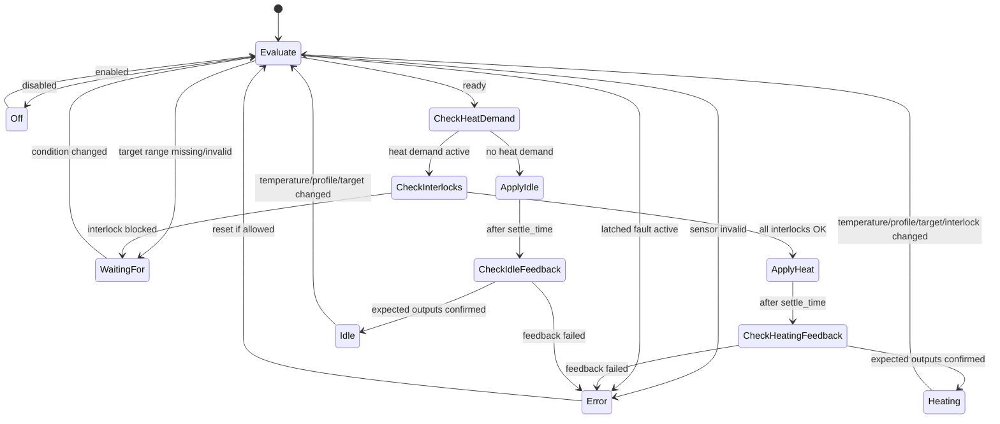

# Controller State Machine

This document describes the proposed state machine for the **Profile-Based Dual-Point Water Heater Controller**.

> Status: Design concept  
> This state machine is not currently implemented in ESPHome.

## Purpose

The controller should behave like a real boiler controller, not just a UI entity.

It must separate:

| Concept | Meaning |
|---|---|
| Power | Whether the water heater is enabled by the user |
| Profile | User-defined heating strategy |
| Action | Current runtime state calculated by the controller |
| Target range | Low/high temperatures used for heat-only dual-point control |
| Interlock | Temporary condition that blocks heating |
| Feedback | Real-world confirmation of heater output state |
| Fault | A real failure that should be visible and handled safely |

## Runtime actions

The controller exposes one runtime action at a time.

| Action | Meaning |
|---|---|
| `off` | The water heater is disabled by the user |
| `idle` | The controller is enabled, but no heating is required |
| `heating` | Heating is required and expected outputs are confirmed active |
| `waiting_for` | Heating is required, but blocked by a temporary condition |
| `error` | A real fault exists, such as invalid temperature data or failed output feedback |

## Action priority

The controller must evaluate states in a strict priority order.

Highest priority wins.

| Priority | Condition | Result |
|---:|---|---|
| 1 | User disabled the water heater | `off` |
| 2 | Target low/high range is missing or invalid | `waiting_for` |
| 3 | Temperature input is invalid | `error` |
| 4 | A latched fault is active | `error` |
| 5 | Heating is required but an active interlock is false | `waiting_for` |
| 6 | Heating is required and allowed | `heating` after feedback confirmation |
| 7 | Heating is not required | `idle` after feedback confirmation |

## Dual-point heat-only control

This controller uses a heat-only low/high target range.

| Condition | Result |
|---|---|
| Current temperature <= target low | Heat demand becomes active |
| Current temperature >= target high | Heat demand becomes inactive |
| Current temperature between low/high | Keep previous demand state unless timing rules require otherwise |

This is not heat/cool dual-point logic.

The high target is the stop-heating point, not a cooling point.

## Main state flow

```text
if water_heater is disabled:
    action = off
    apply current profile idle_action
    stop

if target low/high range is not configured:
    action = waiting_for
    reason = "Target temperature range not configured"
    apply current profile idle_action
    stop

if target range is invalid:
    action = waiting_for
    reason = "Invalid target temperature range"
    apply current profile idle_action
    stop

if any configured temperature sensor is invalid:
    action = error
    fault_reason = "Temperature sensor unavailable or invalid"
    apply current profile idle_action
    stop

if a latched fault exists:
    action = error
    expose fault_reasons
    apply current profile idle_action
    stop

calculate heat demand from target low/high

if heat demand is active:
    check active interlocks for current profile

    if any required interlock is false:
        action = waiting_for
        expose waiting_reasons
        apply current profile idle_action
        stop

    apply current profile heat_action
    wait feedback.settle_time

    if expected heating outputs are confirmed:
        action = heating
        clear non-latched waiting reasons
        stop

    action = error
    expose fault_reasons
    apply current profile idle_action
    stop

else:
    apply current profile idle_action
    wait feedback.settle_time

    if expected idle outputs are confirmed:
        action = idle
        clear non-latched waiting reasons
        stop

    action = error
    expose fault_reasons
    stop
```

## State diagram



## Off state

`off` means the user disabled the water heater.

Expected behavior:

- heat demand is ignored
- current profile idle_action is applied
- runtime action is reported as `off`
- output feedback may still be checked if configured
- profile and target values remain stored

`off` is not a profile.

## Idle state

`idle` means the controller is enabled, but heating is not currently required.

Expected behavior:

- current profile idle_action is applied
- expected idle outputs are checked
- action is reported as `idle` only if feedback confirms the outputs are safe

Example:

```yaml
action: "idle"
profile: "Balanced"
active_outputs: []
fault_reasons: []
waiting_reasons: []
```

## Heating state

`heating` means heating is required and the real outputs match the current profile expectations.

Expected behavior:

- current profile heat_action is applied
- expected heating outputs are checked after feedback.settle_time
- action is reported as `heating` only after feedback confirmation

Example:

```yaml
action: "heating"
profile: "Balanced"
active_outputs:
  - primary_heater_stage
  - assist_heater_stage
fault_reasons: []
waiting_reasons: []
```

## Waiting_for state

`waiting_for` means heating is required or configuration is incomplete, but this is not a fault.

Common causes:

- target low/high range is not configured
- grid power is unavailable
- safe water level is not confirmed
- high-load permission is not granted
- solar power is not sufficient
- scheduled/cheap power window is not active

Expected behavior:

- heat_action is blocked
- current profile idle_action is applied
- one or more waiting reasons are exposed
- controller automatically leaves `waiting_for` when the condition becomes true

Example:

```yaml
action: "waiting_for"
profile: "Fast Recovery"
waiting_reasons:
  - "Waiting for high load permission"
fault_reasons: []
```

## Error state

`error` means a real fault exists.

Common causes:

- temperature sensor unavailable or invalid
- heater stage did not start
- heater stage did not stop
- unexpected heater stage is on
- output feedback does not match expected_outputs
- target/profile data is internally inconsistent

Expected behavior:

- current profile idle_action is applied
- fault reason is exposed
- if fault reset policy is `manual`, the fault remains latched until reset
- if fault reset policy is `auto_when_clear`, the controller may recover automatically after feedback becomes valid again

Example:

```yaml
action: "error"
profile: "Balanced"
fault_reasons:
  - "Assist heater stage did not start"
waiting_reasons: []
```

## Interlock behavior

Interlocks are temporary conditions that can block heating.

They are not faults.

### start_permissive

A `start_permissive` is checked before starting heating.

If it becomes false while already heating, the component may either continue or stop depending on the profile design. The default recommended behavior is to stop heating and enter `waiting_for`.

### run_interlock

A `run_interlock` must remain true while heating.

If it becomes false while heating:

```text
apply current profile idle_action
action = waiting_for
expose waiting_reason
```

## Feedback behavior

Feedback validates real physical output state after actions are executed.

The controller should wait:

```yaml
feedback:
  settle_time: 10s
```

before checking feedback.

### Heating feedback

During `heating`, the controller checks:

```yaml
expected_outputs:
  heating:
    on:
      - required active stages
    off:
      - stages that must remain off
```

### Idle feedback

During `idle`, the controller checks:

```yaml
expected_outputs:
  idle:
    off:
      - all stages expected to be off
```

If feedback does not match expected outputs, the controller enters `error`.

## Timing behavior

Timing rules prevent rapid start/stop cycles.

Recommended options:

```yaml
timing:
  min_heat_run_time: 60s
  min_heat_off_time: 60s
  min_idle_time: 10s
```

Expected behavior:

| Option | Meaning |
|---|---|
| `min_heat_run_time` | Minimum time heating must remain active once started |
| `min_heat_off_time` | Minimum time heating must remain off before restarting |
| `min_idle_time` | Minimum time idle must remain active before changing state |

Interlocks and real faults may override timing rules for safety.

## Profile change behavior

When the user changes profile:

```text
apply old profile idle_action
wait feedback.settle_time
validate old profile idle expected outputs
apply new profile logic
```

This prevents outputs from the old profile remaining active unexpectedly.

If the new profile requires heating and all interlocks are satisfied, the controller may start heating using the new profile.

## Target change behavior

When the user changes target low/high values:

```text
validate target range
recalculate heat demand
evaluate state machine
```

If the range is missing or invalid:

```text
action = waiting_for
reason = "Invalid target temperature range"
```

Target values are runtime values and should be restored internally.

They are not defined as default values in YAML.

## Temperature sensor behavior

The controller may use one or more temperature sensors.

Supported calculation methods:

| Method | Meaning |
|---|---|
| `primary` | Use one selected sensor |
| `average` | Use the average of configured sensors |
| `minimum` | Use the lowest valid sensor value |
| `maximum` | Use the highest valid sensor value |

If `unavailable_behavior: error` is configured and any required sensor becomes invalid:

```text
action = error
fault_reason = "Temperature sensor unavailable or invalid"
apply current profile idle_action
```

## Fault reset behavior

Recommended configuration:

```yaml
faults:
  reset: manual
```

Allowed policies:

| Policy | Meaning |
|---|---|
| `manual` | Fault remains active until user resets it |
| `auto_when_clear` | Fault clears automatically when all conditions become valid |

For real heater output feedback faults, `manual` is the safer default.

## Expected Home Assistant attributes

The controller should expose clear attributes that can be displayed by Home Assistant.

### Heating example

```yaml
profile: "Balanced"
action: "heating"
target_temperature_low: 55.0
target_temperature_high: 65.0
current_temperature: 52.7
temperature_calculation: "average"
active_interlocks: []
waiting_reasons: []
fault_reasons: []
active_outputs:
  - primary_heater_stage
  - assist_heater_stage
```

### Waiting example

```yaml
profile: "Fast Recovery"
action: "waiting_for"
waiting_reasons:
  - "Waiting for high load permission"
fault_reasons: []
active_outputs: []
```

### Error example

```yaml
profile: "Balanced"
action: "error"
fault_reasons:
  - "Assist heater stage did not start"
waiting_reasons: []
active_outputs:
  - primary_heater_stage
```

## Summary

The state machine is designed around five clear runtime actions:

```text
off
idle
heating
waiting_for
error
```

The most important design rule is:

```text
Profile is the selected user-defined heating strategy.
Action is the real runtime state calculated by the controller.
```
